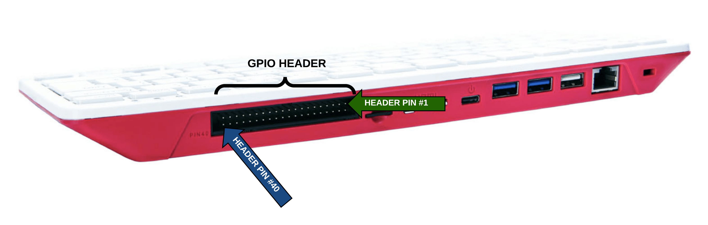
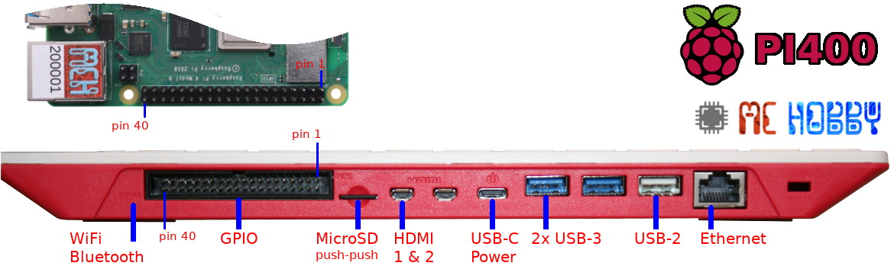
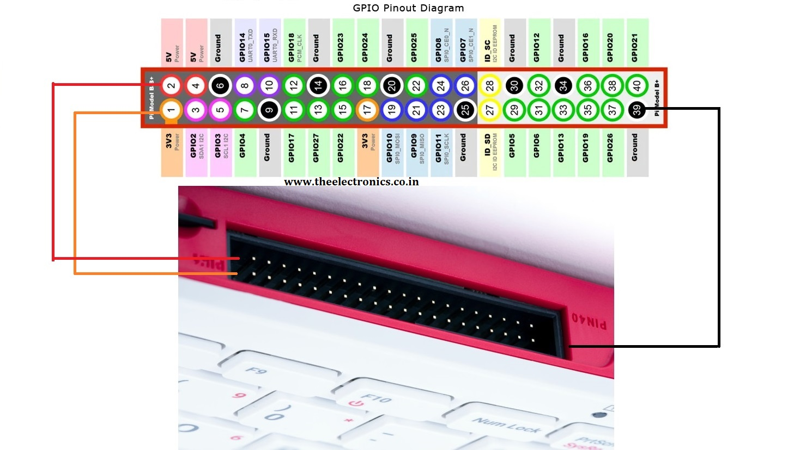

# rpi_osc_gpio
 Send OSC message from sensor connected to GPIO

# PINOUT DIAGRAM

The pin number is set from BOARD numbers and NOT bcm numbering

See explanation here : 

https://raspberrypi.stackexchange.com/questions/12966/what-is-the-difference-between-board-and-bcm-for-gpio-pin-numbering

BOARD numbering doesn't change from raspberry version, BCM version does






# HOW DOES IT WORK

Programm is waiting for a change of the sensor. If change is detected, an OSC message is send in local ip : 127.0.0.1.
Change can be from LOW to HIGH or HIGH TO LOW

# DEPENDENCIES, PYTHON

Python Version : 2.7

`pip install PyOSC`

`sudo apt-get -y install python-rpi.gpio`


# SETTINGS

settings are hardcoded inside the python programm. Edit it to change them.

```
CHANNEL = 11
WAITFORRAISE = True
MSGADDRESS = "playmain"
MSGARG = 0 
PORT = 12345
```

* CHANNEL :  input pin of the sensor
* WAITFORRAISE : if true, looking to LOW to HIGH, is false, the contrary
* MSGADDRESS : "/" is automatically added
* MSGARD : has to be ONE argument only
* PORT : port to send the message to.


